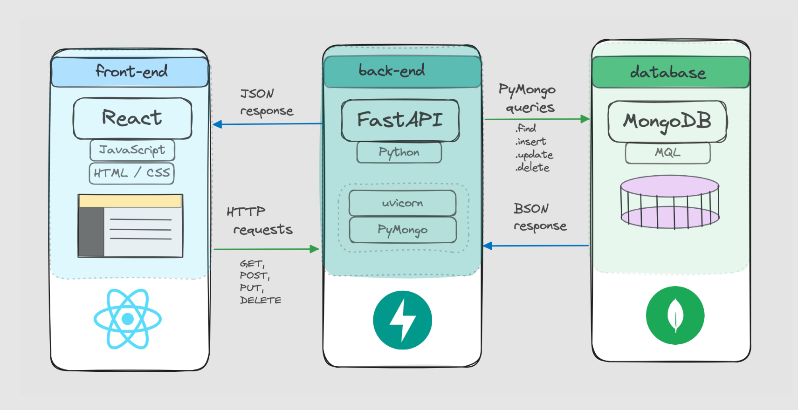

# FARM seed

A seed project for building web applications using the FARM stack - FastAPI, React, and MongoDB.



## About

This project provides a starting point for building a web app using Python's FastAPI for the backend API, React for the frontend, and MongoDB as the database. It includes basic scaffolding of each component to get started.

## Getting Started

### Prerequisites

Ensure you have the following prerequisites installed on your development environment:

- Python 3.7+
- Node.js
- MongoDB

### Installation

1. Clone the repo

   ```bash
   git clone https://github.com/brianrabern/farmseed.git
   ```

2. Set up MongoDB

   a. Download and install MongoDB Community Server edition. (On macOS: `brew install mongodb`)

   b. Create data directory:

   ```bash
   mkdir ~/data
   mkdir ~/data/db
   ```

   c. Run MongoDB daemon:

   ```bash
   mongod --dbpath ~/data/db
   ```

3. Set up FastAPI backend

   - `cd backend`
   - `pip install -r requirements.txt`
   - `uvicorn main:app --reload`

4. Set up React frontend

   - `cd frontend`
   - `npm install`
   - `npm start`

The FastAPI backend will run on `http://localhost:8000`.
The React frontend will run on `http://localhost:3000`.

## Usage

The FastAPI backend offers essential API endpoints for standard CRUD (Create, Read, Update, Delete) operations. The React frontend includes sample components that correspond to these endpoints, providing a starting point for your user interface.

You can extend the project's functionality by:

- Defining Pydantic models for your data.
- Expanding the range of React components and creating new pages.
- Implementing user authentication for enhanced security.
- Containerizing the application using Docker to simplify deployment and scaling.

With FARM seed, you have a versatile and well-structured base for building web applications using the FARM stack. Feel free to tailor it to your specific project requirements and scale it as needed.
